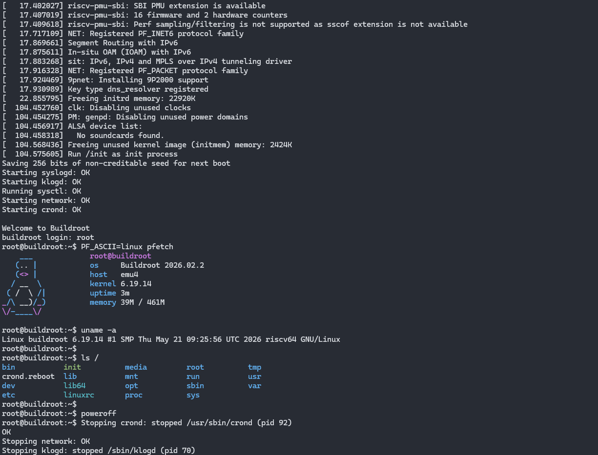

# Emu4 - RV64IMAC Emulator in Rust

This is a complete application-class single-core RISC-V emulator running OpenSBI + Linux

- Complete RV64IMAC instruction coverage
- [Buildroot](https://github.com/buildroot/buildroot) used to compile the OS components
- Core RISC-V peripherals implemented (CLINT and PLIC)
- Additional peripherals (UART and generic Linux Syscon)
- Cosimulation shim using [Spike](https://github.com/riscv-software-src/riscv-isa-sim) used to debug issues and maintain parity

<br>


<br>

## Overview
The core simulation code is in [`libemu4`](libemu4):
- [`lib.rs`](libemu4/src/lib.rs): Contains the top-level CPU struct
- [`csr.rs`](libemu4/src/csr.rs): The CSR register file with CPU mode and read/write access logic
- [`mmu.rs`](libemu4/src/mmu.rs): `Sv39` compliant MMU
- [`trap.rs`](libemu4/src/trap.rs): Interrupt and exception handling logic
- [`decode`](libemu4/src/decode): Instruction decoder module including compressed 16-bit instructions
- [`exec.rs`](libemu4/src/exec.rs): Core instruction execution logic
- [`devices`](libemu4/src/devices): Peripheral devices including PLIC, CLINT, 8250/16550 compatible UART, RAM and Syscon

[`emu4_gold`](emu4_gold) then uses `libemu4` to create a "golden model" simulator.

> [!WARNING]
> Spike cosimulation is currently commented out. I will add a proper CLI arg switch for it and re-enable it

## Building and Running
Update `third_party` submodules using:
```
git submodule update --init --recursive
```

Then run:
```
make build
```
to compile the device tree and build the `buildroot` image.

This will take a **lot of time** because buildroot will compile a toolchain, then the kernel, then the busybox tools

> [!NOTE]
> If the buildroot build OOMs, try reducing the number of parallel jobs:
> ```
> # Equivalent to -j4 
> BR2_JLEVEL=4 make build
> ```
> By default, buildroot uses how many ever cores are present

Once those two are built:
```
cd emu4_gold
cargo run --release
```

This will begin booting the OpenSBI + Linux + buildroot rootfs payload
